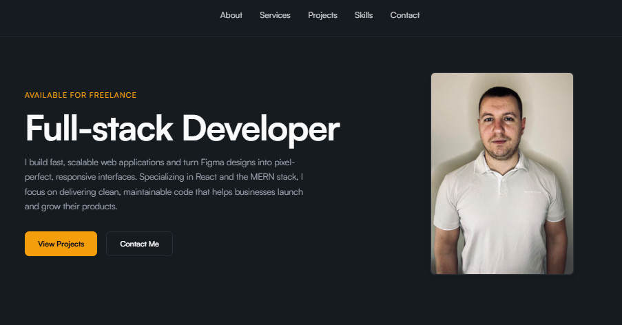
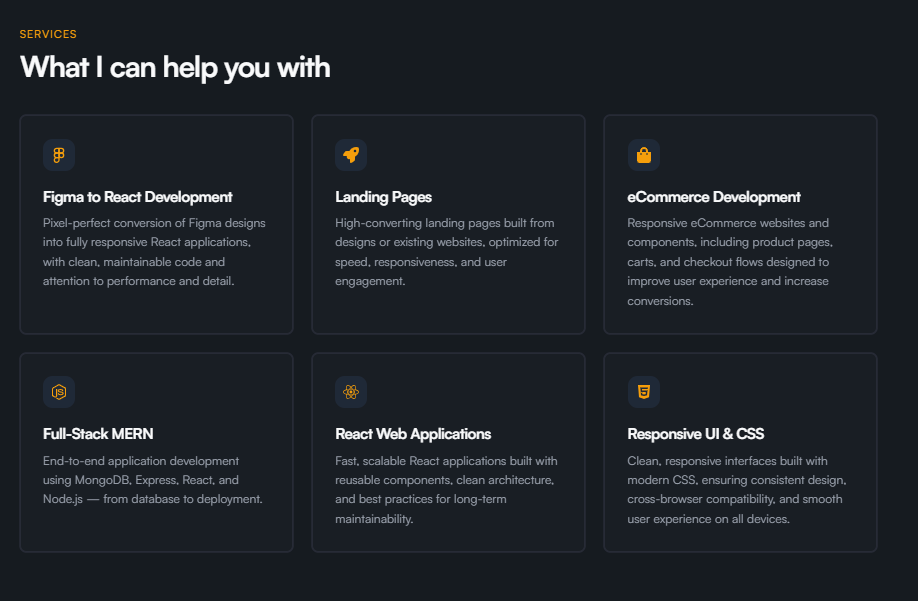
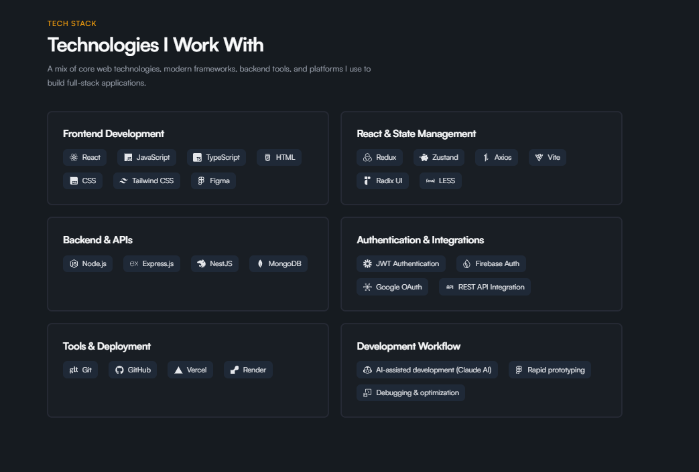
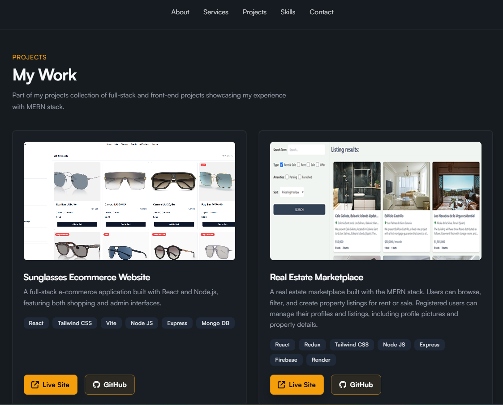

# Garenov Full-Stack Dev Portfolio ✨🚀💼

🌐 **Live site**: `https://georgigarenovportfolio.netlify.app/` 🔗👆

## 📸 Screenshots 🖼️✨

| 📱                                                                          | 🖥️                                                          |
| :-------------------------------------------------------------------------- | :---------------------------------------------------------- |
| 🏠  | 🛠️  |
| 🧠       | 📂   |

## 🧰⚙️ What this repository is built with 🔧

This is a static **React** SPA ⚛️ — a fast, snappy portfolio you can host anywhere 📦✨

| 🎯 Area                 | ✅ Choice                                                    |
| ----------------------- | ------------------------------------------------------------ |
| 🖼️ UI                   | **React 19** ⚛️                                             |
| 🧭 Routing              | **React Router DOM** 7 🗺️                                   |
| ⚡ Bundler & dev server | **Vite** 8                                                   |
| 🎨 Icons                | **react-icons** 😎                                          |
| ✅ Linting              | **ESLint** 9 (flat config, React Hooks + Refresh plugins) 🧹 |
| 🎭 Styles               | **Plain CSS** (per-page and per-component stylesheets) 📝   |

💡 **Data-driven content** — projects, skills, and services come from files under `src/data/` 📁 so you can update copy and links without touching layout components 🙌🧠

## 🚦 Getting started 🎬

### 📋 Prerequisites ✅

- **Node.js** 🟢 (recent LTS recommended ⭐)
- **npm** 📦 (ships with Node 🚢)

### 📥 Install and run ▶️

```bash
npm install
npm run dev
```

🔗 Use the URL Vite prints (usually `http://localhost:5173`) 🌐✨

## 📜 Scripts 🎮

```bash
npm run dev      # 🔥 Development server
npm run build    # 📦 Production build
npm run preview  # 👀 Preview production build locally
npm run lint     # 🧹 ESLint
```

## 🗂️ Project layout 📂

```text
src/
  assets/            # 🖼️ Images (including screenshots/)
  components/        # 🧩 Reusable UI
  data/              # 📊 Portfolio content (projects, skills, services)
  pages/             # 📄 Route pages (About, Projects, etc.)
```

## ✏️ Updating site content 📝🔄

Edit the files in `src/data/` 📁:

- 🚀 **Projects** — `projectData.js`
- 🛠️ **Services** — `services.js`
- 🧠 **Skills** — `skills.js`

---

Made with ❤️ ⭐ Happy coding! 🎉👨‍💻👩‍💻
